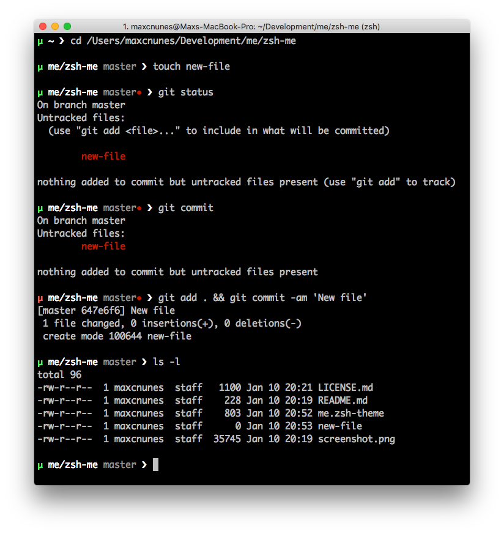

## μ (me) theme for Oh My Zsh

A minimal theme for [oh-my-zsh](https://github.com/robbyrussell/oh-my-zsh) prompt.



# Installing the theme

**IMPORTANT: oh-my-zsh must be configured already**

Download theme file into the themes custom directory:

```bash
mkdir -p ~/.oh-my-zsh/custom/themes/

wget \
  -O ~/.oh-my-zsh/custom/themes/me.zsh-theme \
  https://raw.githubusercontent.com/maxcnunes/zsh-me/master/me.zsh-theme
```

Then edit `~/.zshrc` to use it:

```bash
ZSH_THEME="me"
```

And restart your terminal.
